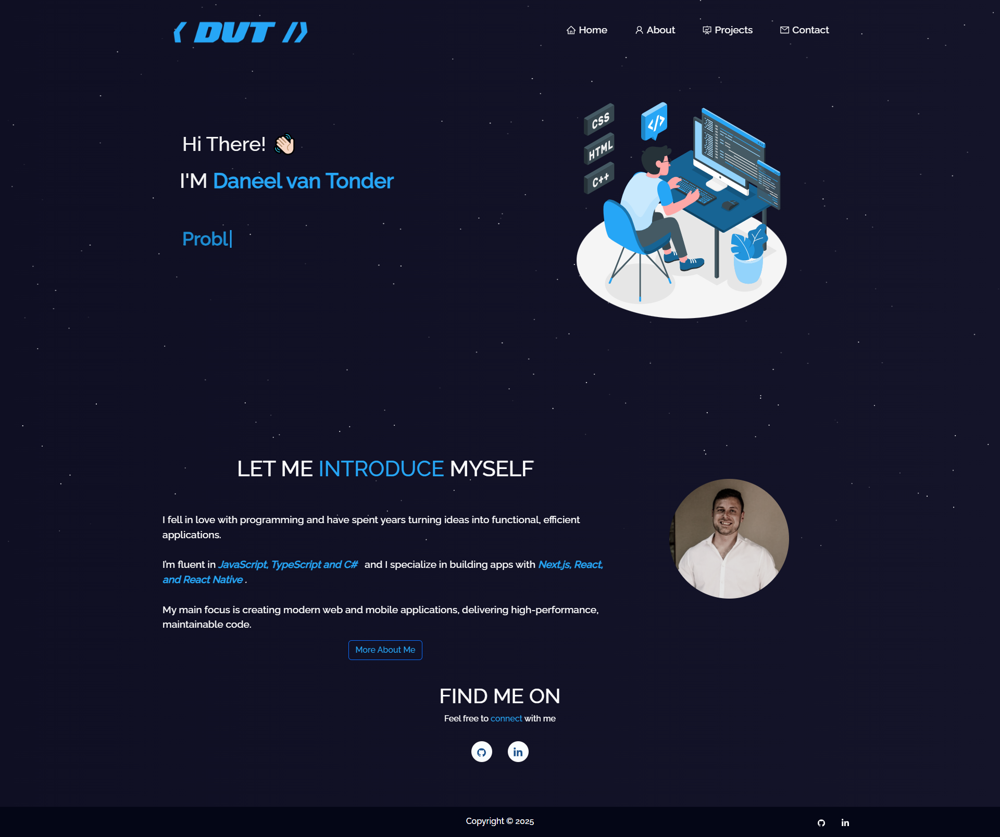
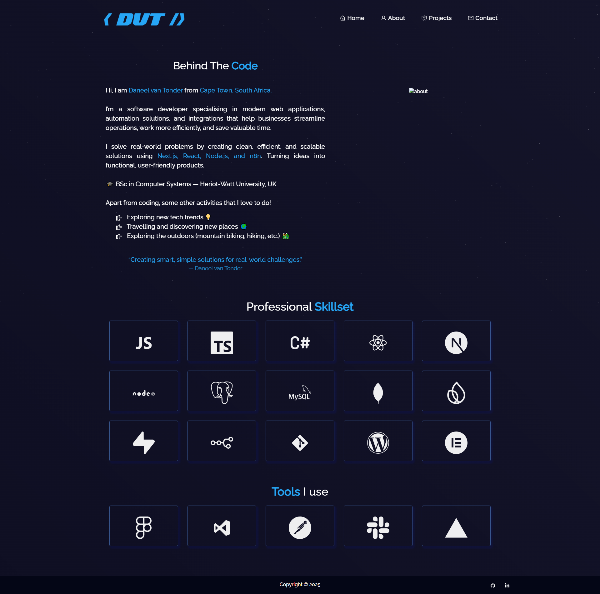

# 🚀 Portfolio Website

> My portfolio webiste built with React.

[](LICENSE)
[]()

---

## 📸 Demo / Screenshots

<p align="center">
  
  
</p>

---

## 🛠 Tech Stack

**Frontend:** React, Bootsrap
**Backend:** None
**Database:** None

---

## ⚙️ Installation

```bash
# Clone the repo
git clone https://github.com/Daneelv/daneelv.github.io.git

# Install dependencies
npm install

# Run locally
npm start
```
